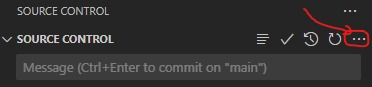

TRUCOS DE GITHUB

Para subir archivos:
- Stage los archivos que quieres subir (el + al lado de cada archivo)
- Commit al repositorio local (CON UN MENSAJE)
- Push (Sync Changes) al repositorio en la nube

Para bajar archivos:
- Pull (en los tres puntitos de la foto)

